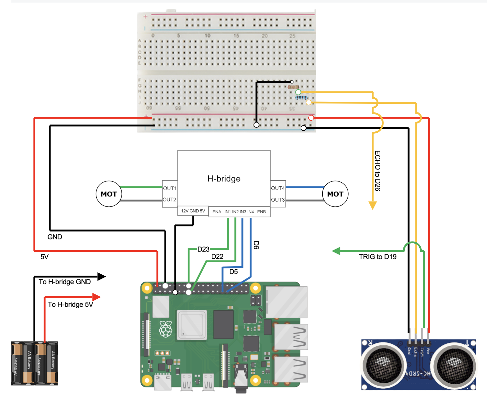

# Ball Tracking Robot
This is a ball tracking robot that uses a Raspberry Pi as the minicomputer, a PiCamera for vision, and DC motors to drive the robot. The robot will see the ball and follow it.


| **Engineer** | **School** | **Area of Interest** | **Grade** |
|:--:|:--:|:--:|:--:|
| Kousha A | Los Gatos High School | Mechanical Engineering | Incoming Junior


  
# Final Milestone

<iframe width="1192" height="670" src="https://www.youtube.com/embed/2VFJ4_xaSBM" title="Kousha A. Milestone 3" frameborder="0" allow="accelerometer; autoplay; clipboard-write; encrypted-media; gyroscope; picture-in-picture; web-share" referrerpolicy="strict-origin-when-cross-origin" allowfullscreen></iframe>

For my Final milestone, I got my ball tracking working and started creating my UI for the user. One thing I struggled with was the intake being very heavy, but I solved that by using string to pull back the intake and bring the CoG farther back on the bot.

# Second Milestone

For my second milestone, I completed the basic drivetrain code for my robot. My robot now drives with WASD, and I created a simple localhost to run the commands on. The page is very simple for now, but it will be nicer once I add more commands and things for my third milestone.


# First Milestone

<iframe width="560" height="315" src="https://www.youtube.com/embed/J8QkySfiItk?si=2F1nYljTh8tQl-XF" title="YouTube video player" frameborder="0" allow="accelerometer; autoplay; clipboard-write; encrypted-media; gyroscope; picture-in-picture; web-share" referrerpolicy="strict-origin-when-cross-origin" allowfullscreen></iframe>


For my first milestone, I completed the assembly of the main drivetrain. I started by wiring the ultrasonic sensors to my breadboard, ensuring I use the correct resistors to adjust the voltage. Next I connected my Raspberry Pi to the breadboard, noting the GPIO ports used because I would need them in my code. Finally, I connected the H-Bridge to the power supply, the Raspberry Pi, and the drive motors.

# Schematics 


# Code


```python

import cv2
import RPi.GPIO as GPIO
import time
import threading
import numpy as np
import traceback
import sys
import tty
import termios
import select

from libcamera import Transform
from flask import Flask, Response
from picamera2 import Picamera2


GPIO.setwarnings(False)

GPIO.setmode(GPIO.BCM)


MOTOR1B = 6 #leftMotor
MOTOR1E = 5

MOTOR2B = 22 #rightMotor
MOTOR2E = 23

MOTOR3B = 16 #intakeMotor
MOTOR3E = 17

GPIO.setup(MOTOR1B, GPIO.OUT)
GPIO.setup(MOTOR1E, GPIO.OUT)

GPIO.setup(MOTOR2B, GPIO.OUT)
GPIO.setup(MOTOR2E, GPIO.OUT)

GPIO.setup(MOTOR3B, GPIO.OUT)
GPIO.setup(MOTOR3E, GPIO.OUT)

GPIO.output(MOTOR3B, GPIO.LOW)
GPIO.output(MOTOR3E, GPIO.LOW)


# --- Movement functions ---
def forward():
    GPIO.output(MOTOR1B, GPIO.HIGH)
    GPIO.output(MOTOR1E, GPIO.LOW)
    GPIO.output(MOTOR2B, GPIO.LOW)
    GPIO.output(MOTOR2E, GPIO.HIGH)

def reverse():
    GPIO.output(MOTOR1B, GPIO.LOW)
    GPIO.output(MOTOR1E, GPIO.HIGH)
    GPIO.output(MOTOR2B, GPIO.HIGH)
    GPIO.output(MOTOR2E, GPIO.LOW)

def leftturn():
    GPIO.output(MOTOR1B, GPIO.LOW)
    GPIO.output(MOTOR1E, GPIO.LOW)
    GPIO.output(MOTOR2B, GPIO.LOW)
    GPIO.output(MOTOR2E, GPIO.HIGH)

def rightturn():
    GPIO.output(MOTOR1B, GPIO.HIGH)
    GPIO.output(MOTOR1E, GPIO.LOW)
    GPIO.output(MOTOR2B, GPIO.LOW)
    GPIO.output(MOTOR2E, GPIO.LOW)

def stop():
    GPIO.output(MOTOR1B, GPIO.LOW)
    GPIO.output(MOTOR1E, GPIO.LOW)
    GPIO.output(MOTOR2B, GPIO.LOW)
    GPIO.output(MOTOR2E, GPIO.LOW)

def sharp_left():
    GPIO.output(MOTOR1B, GPIO.LOW)
    GPIO.output(MOTOR1E, GPIO.HIGH)
    GPIO.output(MOTOR2B, GPIO.LOW)
    GPIO.output(MOTOR2E, GPIO.HIGH)

def sharp_right():
    GPIO.output(MOTOR1B, GPIO.HIGH)
    GPIO.output(MOTOR1E, GPIO.LOW)
    GPIO.output(MOTOR2B, GPIO.HIGH)
    GPIO.output(MOTOR2E, GPIO.LOW)

def back_left():
    GPIO.output(MOTOR1B, GPIO.LOW)
    GPIO.output(MOTOR1E, GPIO.HIGH)
    GPIO.output(MOTOR2B, GPIO.LOW)
    GPIO.output(MOTOR2E, GPIO.LOW)

def back_right():
    GPIO.output(MOTOR1B, GPIO.LOW)
    GPIO.output(MOTOR1E, GPIO.LOW)
    GPIO.output(MOTOR2B, GPIO.HIGH)
    GPIO.output(MOTOR2E, GPIO.LOW)

def intake():
    GPIO.output(MOTOR3B, GPIO.LOW)
    GPIO.output(MOTOR3E, GPIO.HIGH)

def outtake():
    GPIO.output(MOTOR3B, GPIO.HIGH)
    GPIO.output(MOTOR3E, GPIO.LOW)

def stoptake():
    GPIO.output(MOTOR3B, GPIO.LOW)
    GPIO.output(MOTOR3E, GPIO.LOW)

def spin_slow(duty_cycle, pulse_time):
    """
    Drives forward at reduced speed by pulsing the motor on/off.
    duty_cycle: fraction of time motor is ON (0.0 to 1.0) — lower = slower
    pulse_time: total length of one on/off cycle, in seconds
    """
    on_time = pulse_time * duty_cycle
    off_time = pulse_time * (1 - duty_cycle)

    sharp_right()
    time.sleep(on_time)
    stop()
    time.sleep(off_time)


# --- Vision functions ---
def segment_colour(frame):
    hsv_roi = cv2.cvtColor(frame, cv2.COLOR_BGR2HSV)
    mask_1 = cv2.inRange(hsv_roi, np.array([0, 60, 40]), np.array([10, 255, 255]))
    mask_2 = cv2.inRange(hsv_roi, np.array([160, 60, 40]), np.array([179, 255, 255]))
    mask = cv2.bitwise_or(mask_1, mask_2)
    kern_dilate = np.ones((8, 8), np.uint8)
    kern_erode = np.ones((3, 3), np.uint8)
    mask = cv2.erode(mask, kern_erode)
    mask = cv2.dilate(mask, kern_dilate)
    return mask

def find_blob(blob, min_area=400):
    """Returns the largest white blob's bounding box and area."""
    largest_contour = 0
    cont_index = -1
    contours, hierarchy = cv2.findContours(blob, cv2.RETR_CCOMP, cv2.CHAIN_APPROX_SIMPLE)
    for idx, contour in enumerate(contours):
        area = cv2.contourArea(contour)
        if area < min_area:
            continue
        if area > largest_contour:
            largest_contour = area
            cont_index = idx
    r = (0, 0, 2, 2)
    if cont_index != -1:
        r = cv2.boundingRect(contours[cont_index])
    return r, largest_contour


# --- Video streaming + keyboard control setup ---
app = Flask(__name__)
latest_frame = None
latest_mask = None
frame_lock = threading.Lock()
mask_lock = threading.Lock()

held_keys = set()
direction_lock = threading.Lock()


def generate_frame():
    last_sent = None
    while True:
        with frame_lock:
            frame_bytes = latest_frame
        if frame_bytes is None or frame_bytes is last_sent:
            time.sleep(0.01)
            continue
        last_sent = frame_bytes
        yield (b'--frame\r\n'
               b'Content-Type: image/jpeg\r\n\r\n' + frame_bytes + b'\r\n')
        time.sleep(0.03)


def generate_mask():
    last_sent = None
    while True:
        with mask_lock:
            mask_bytes = latest_mask
        if mask_bytes is None or mask_bytes is last_sent:
            time.sleep(0.01)
            continue
        last_sent = mask_bytes
        yield (b'--frame\r\n'
               b'Content-Type: image/jpeg\r\n\r\n' + mask_bytes + b'\r\n')
        time.sleep(0.03)

@app.route('/')
def index():
    return """
    <!DOCTYPE html>
    <html>
    <head>
    <meta charset="utf-8">
    <title>Red Ball Tracker</title>
    <link rel="preconnect" href="https://fonts.googleapis.com">
    <link href="https://fonts.googleapis.com/css2?family=JetBrains+Mono:wght@400;500;600;700&display=swap" rel="stylesheet">
    <style>
      :root {
        --bg: #0a0d10;
        --panel: #12161b;
        --border: #232830;
        --text: #e7ecef;
        --muted: #7c8791;
        --amber: #ffb020;
        --cyan: #48d1c7;
      }

      * { box-sizing: border-box; }

      body {
        margin: 0;
        min-height: 100vh;
        background:
          radial-gradient(circle at 50% 0%, #161b21 0%, var(--bg) 55%);
        color: var(--text);
        font-family: 'JetBrains Mono', monospace;
        display: flex;
        align-items: center;
        justify-content: center;
        padding: 32px 16px;
      }

      .stage {
        width: 100%;
        max-width: 720px;
        display: flex;
        flex-direction: column;
        gap: 18px;
      }

      .topbar {
        display: flex;
        align-items: center;
        justify-content: space-between;
        padding: 0 2px;
      }

      .brand {
        font-size: 13px;
        font-weight: 600;
        letter-spacing: 0.12em;
        color: var(--text);
      }

      .brand-sub {
        display: block;
        margin-top: 2px;
        font-size: 10px;
        font-weight: 400;
        letter-spacing: 0.14em;
        color: var(--muted);
      }

      .mode-chip {
        display: flex;
        align-items: center;
        gap: 8px;
        padding: 7px 14px;
        border: 1px solid var(--border);
        border-radius: 999px;
        background: var(--panel);
        font-size: 11px;
        font-weight: 600;
        letter-spacing: 0.1em;
        transition: border-color 0.25s ease, color 0.25s ease;
      }

      .mode-chip .dot {
        width: 7px;
        height: 7px;
        border-radius: 50%;
        background: var(--amber);
        box-shadow: 0 0 8px var(--amber);
        animation: pulse 1.6s ease-in-out infinite;
      }

      .mode-chip.manual .dot {
        background: var(--cyan);
        box-shadow: 0 0 8px var(--cyan);
      }

      .mode-chip.tracking { color: var(--amber); border-color: rgba(255,176,32,0.35); }
      .mode-chip.manual { color: var(--cyan); border-color: rgba(72,209,199,0.35); }

      @keyframes pulse {
        0%, 100% { opacity: 1; }
        50% { opacity: 0.35; }
      }

      .viewfinder {
        position: relative;
        border-radius: 4px;
        overflow: hidden;
        background: #000;
        border: 1px solid var(--border);
        box-shadow: 0 20px 60px -20px rgba(0,0,0,0.7);
      }

      .viewfinder .feed {
        display: block;
        width: 100%;
        height: auto;
        opacity: 0.96;
      }

      .corner {
        position: absolute;
        width: 22px;
        height: 22px;
        border: 2px solid var(--amber);
        z-index: 3;
        opacity: 0.85;
      }
      .corner.tl { top: 10px; left: 10px; border-right: none; border-bottom: none; }
      .corner.tr { top: 10px; right: 10px; border-left: none; border-bottom: none; }
      .corner.bl { bottom: 10px; left: 10px; border-right: none; border-top: none; }
      .corner.br { bottom: 10px; right: 10px; border-left: none; border-top: none; }

      .reticle-sweep {
        position: absolute;
        left: 0; right: 0;
        height: 2px;
        background: linear-gradient(90deg, transparent, rgba(255,176,32,0.55), transparent);
        top: 0;
        z-index: 2;
        animation: sweep 4.5s linear infinite;
        pointer-events: none;
      }

      @keyframes sweep {
        0% { top: 0%; opacity: 0; }
        8% { opacity: 1; }
        92% { opacity: 1; }
        100% { top: 100%; opacity: 0; }
      }

      .feed-label {
        position: absolute;
        bottom: 10px;
        left: 12px;
        font-size: 10px;
        letter-spacing: 0.1em;
        color: var(--amber);
        background: rgba(10,13,16,0.55);
        padding: 3px 8px;
        border-radius: 3px;
        z-index: 3;
      }

      .telemetry {
        background: var(--panel);
        border: 1px solid var(--border);
        border-radius: 6px;
        padding: 16px 18px;
      }

      .keys-row {
        display: flex;
        flex-wrap: wrap;
        gap: 8px;
      }

      .key {
        border: 1px solid var(--border);
        background: #0d1114;
        color: var(--muted);
        font-size: 11px;
        font-weight: 600;
        letter-spacing: 0.06em;
        padding: 8px 12px;
        border-radius: 4px;
        transition: all 0.12s ease;
      }

      .key.wide { padding: 8px 14px; }

      .key.active {
        color: #0a0d10;
        background: var(--amber);
        border-color: var(--amber);
        box-shadow: 0 0 14px rgba(255,176,32,0.45);
      }

      .hint {
        margin-top: 12px;
        font-size: 10.5px;
        color: var(--muted);
        letter-spacing: 0.04em;
      }
    </style>
    </head>
    <body>
      <div class="stage">
        <div class="topbar">
          <div class="brand">
            RED&nbsp;BALL&nbsp;TRACKER
            <span class="brand-sub">VISUAL SERVO UNIT · CAM 01</span>
          </div>
          <div class="mode-chip tracking" id="mode-chip">
            <span class="dot"></span>
            <span id="mode-text">TRACKING</span>
          </div>
        </div>

        <div class="viewfinder">
          <div class="corner tl"></div>
          <div class="corner tr"></div>
          <div class="corner bl"></div>
          <div class="corner br"></div>
          <div class="reticle-sweep"></div>
          
          <div class="feed-label">● LIVE</div>
        </div>

        <div class="telemetry">
          <div class="keys-row">
            <div class="key" data-key="w">W</div>
            <div class="key" data-key="a">A</div>
            <div class="key" data-key="s">S</div>
            <div class="key" data-key="d">D</div>
            <div class="key wide" data-key="shift">SHIFT · INTAKE</div>
            <div class="key wide" data-key="e">E · OUTTAKE</div>
            <div class="key" data-key="q">Q · MODE</div>
          </div>
          <div class="hint">click this page, then hold keys to drive in manual mode</div>
        </div>
      </div>

      <script>
        const keys = ['w', 'a', 's', 'd', 'e', 'shift', 'q'];
        const pressed = new Set();

        function updateKeyVisuals() {
          document.querySelectorAll('.key').forEach(el => {
            const k = el.dataset.key;
            el.classList.toggle('active', pressed.has(k));
          });
        }

        document.addEventListener('keydown', (e) => {
          const k = e.key.toLowerCase();
          if (keys.includes(k) && !pressed.has(k)) {
            pressed.add(k);
            fetch(`/key/down/${k}`);
            updateKeyVisuals();
          }
        });

        document.addEventListener('keyup', (e) => {
          const k = e.key.toLowerCase();
          if (keys.includes(k)) {
            pressed.delete(k);
            fetch(`/key/up/${k}`);
            updateKeyVisuals();
          }
        });

        window.addEventListener('blur', () => {
          pressed.clear();
          updateKeyVisuals();
        });

        async function pollMode() {
          try {
            const res = await fetch('/mode');
            const modeText = (await res.text()).trim();
            const chip = document.getElementById('mode-chip');
            const label = document.getElementById('mode-text');
            label.innerText = modeText.toUpperCase();
            chip.classList.toggle('tracking', modeText === 'tracking');
            chip.classList.toggle('manual', modeText === 'manual');
          } catch (err) {
            document.getElementById('mode-text').innerText = 'OFFLINE';
          }
          setTimeout(pollMode, 300);
        }
        pollMode();
      </script>
    </body>
    </html>
    """

@app.route('/video_feed')
def video_feed():
    return Response(generate_frame(), mimetype='multipart/x-mixed-replace; boundary=frame')


@app.route('/mask_feed')
def mask_feed():
    return Response(generate_mask(), mimetype='multipart/x-mixed-replace; boundary=frame')


@app.route('/key/<action>/<key>')
def key_event(action, key):
    global mode, contact_made, contact_time
    with direction_lock:
        if action == 'down':
            held_keys.add(key)
        elif action == 'up':
            held_keys.discard(key)

    if key == 'q' and action == 'down':
        print(f"q pressed! current mode before toggle: {mode}")
        if mode == "tracking":
            mode = "manual"
        else:
            mode = "tracking"
            contact_made = False
            contact_time = None
        print(f"mode after toggle: {mode}")

    return '', 204

@app.route('/mode')
def get_mode():
    return mode


def run_server():
    app.run(host='0.0.0.0', port=8000, threaded=True)


threading.Thread(target=run_server, daemon=True).start()


# --- Camera setup ---
picam2 = Picamera2()
picam2.configure(picam2.create_preview_configuration(
    main={"format": 'RGB888', "size": (320, 240)},
    transform=Transform(hflip=1, vflip=1)
))
picam2.start()
picam2.set_controls({"AeEnable": False, "ExposureTime": 20000, "AnalogueGain": 2.0})
time.sleep(2)


# --- Ball-following config ---
FRAME_WIDTH = 320
CENTER_TOLERANCE = 40
TOUCH_WIDTH_THRESHOLD = 290
POST_CONTACT_DRIVE_TIME = 1.5

contact_made = False
contact_time = None

mode = "tracking"
q_prev_held = False  
contact_made = False
contact_time = None


try:
    while True:
        frame = picam2.capture_array()

        # Publish frame for browser streaming
        ret, jpeg = cv2.imencode('.jpg', frame)
        if ret:
            with frame_lock:
                latest_frame = jpeg.tobytes()

        mask = segment_colour(frame)
        ret_mask, jpeg_mask = cv2.imencode('.jpg', mask)
        if ret_mask:
            with mask_lock:
                latest_mask = jpeg_mask.tobytes()

        with direction_lock:
            keys = held_keys.copy()

        w_held = "w" in keys
        a_held = "a" in keys
        d_held = "d" in keys
        s_held = "s" in keys
        e_held = "e" in keys
        shift_held = "shift" in keys

        if mode == "tracking":
            r, area = find_blob(mask, min_area=350)
            x, y, w, h = r
            cv2.rectangle(frame, (x, y), (x + w, y + h), (0, 255, 0), 2)
            
            if not contact_made:
                if area == 0:
                    spin_slow(0.6, 0.05)
                else:
                    ball_center_x = x + w // 2
                    frame_center_x = FRAME_WIDTH // 2
                    offset = ball_center_x - frame_center_x

                    if w >= TOUCH_WIDTH_THRESHOLD:
                        contact_made = True
                        contact_time = time.time()
                        forward()
                        stoptake()
                    elif offset < -CENTER_TOLERANCE:
                        leftturn()
                        outtake()
                    elif offset > CENTER_TOLERANCE:
                        rightturn()
                        outtake()
                    else:
                        forward()
                        stoptake()
            else:
                if time.time() - contact_time < POST_CONTACT_DRIVE_TIME:
                    forward()
                    intake()
                else:
                    print("Contact complete — switching to manual mode.")
                    mode = "manual"

        else:  # mode == "manual"
            stoptake()
            if w_held and a_held:
                leftturn()
            elif w_held and d_held:
                rightturn()
            elif w_held:
                forward()
            elif a_held:
                sharp_left()
            elif d_held:
                sharp_right()
            elif s_held:
                reverse()
            else:
                stop()

            if shift_held:
                intake()
            elif e_held:
                outtake()
            else:
                stoptake()

except KeyboardInterrupt:
    pass
except Exception:
    traceback.print_exc()
finally:
    stop()
    stoptake()
    GPIO.cleanup()
```


# Bill of Materials

| **Part** | **Note** | **Price** | **Link** |
|:--:|:--:|:--:|:--:|
| Raspberri Pi 4 Model B | Minicomputer used to write code and control the robot | $79.97 | <a href="https://www.amazon.com/Raspberry-Model-2019-Quad-Bluetooth/dp/B07TC2BK1X?source=ps-sl-shoppingads-lpcontext&ref_=fplfs&smid=A2QE71HEBJRNZE&th=1"> <ins>Link</ins> </a> |
|:--:|:--:|:--:|:--:|
| Raspberry Pi Camera Module | The camera used for live video capture. | $14.99 | <a href="https://www.amazon.com/Arducam-Autofocus-Raspberry-Motorized-Software/dp/B07SN8GYGD/ref=sr_1_5?crid=3236VFT39VAPQ&keywords=picamera&qid=1689698732&s=electronics&sprefix=picamer%2Celectronics%2C138&sr=1-5"> <ins>Link</ins> </a> |
|:--:|:--:|:--:|:--:|
| L298N Driver Board | Basic motor driver board which drives the wheels forward and backward. | $8.99 | <a href="https://www.amazon.com/Qunqi-2Packs-Controller-Stepper-Arduino/dp/B01M29YK5U/ref=sr_1_1_sspa?crid=3DE9ZH0NI3KJX&keywords=l298n&qid=1689698859&s=electronics&sprefix=l298n%2Celectronics%2C164&sr=1-1-spons&sp_csd=d2lkZ2V0TmFtZT1zcF9hdGY&psc=1"> <ins>Link</ins> </a> |
|:--:|:--:|:--:|:--:|
| Motors and Board kit | Basic hardware pieces for structural assembly of the robot. | $13.59 | <a href="https://www.amazon.com/Smart-Chassis-Motors-Encoder-Battery/dp/B01LXY7CM3/ref=sr_1_4?crid=27ACD61NPNLO4&keywords=robot+car+kit&qid=1689698962&s=electronics&sprefix=robot+car+kit%2Celectronics%2C169&sr=1-4"> <ins>Link</ins> </a> |
|:--:|:--:|:--:|:--:|
| Powerbank | Compact and portable external power supply with USB-C for Raspberry Pi | $21.98 | <a href="https://www.amazon.com/Anker-Ultra-Compact-High-Speed-VoltageBoost-Technology/dp/B07QXV6N1B/ref=sr_1_1_sspa?crid=53ULGW8ZNDOW&keywords=power+bank&qid=1689699045&s=electronics&sprefix=power+bank%2Celectronics%2C144&sr=1-1-spons&sp_csd=d2lkZ2V0TmFtZT1zcF9hdGY&psc=1"> <ins>Link</ins> </a> |
|:--:|:--:|:--:|:--:|
| HC-SR04 sensors (5 pcs) | Used for distance calculations of unwanted obstacles or objects. | $8.99 | <a href="https://www.amazon.com/Organizer-Ultrasonic-Distance-MEGA2560-ElecRight/dp/B07RGB4W8V/ref=sr_1_2?crid=UYI359LWAAVU&keywords=hc+sr04+ultrasonic+sensor+3+pc&qid=1689699122&s=electronics&sprefix=hc+sr04+ultrasonic+sensor+3+pc%2Celectronics%2C123&sr=1-2"> <ins>Link</ins> </a> |
|:--:|:--:|:--:|:--:|
| HDMI to micro HDMI cable | Used to display Pi contents on monitor. | $8.99 | <a href="https://www.amazon.com/UGREEN-Adapter-Ethernet-Compatible-Raspberry/dp/B06WWQ7KLV/ref=sr_1_5?crid=3S06RDX7B1X4O&keywords=hdmi+to+micro+hdmi&qid=1689699482&s=electronics&sprefix=hdmi+to+micro%2Celectronics%2C132&sr=1-5"> <ins>Link</ins> </a> |
|:--:|:--:|:--:|:--:|
| Video Capture card | Capture card is necessary to display onto laptops (unnecessary for separate monitors). | $16.98 | <a href="https://www.amazon.com/Capture-Streaming-Broadcasting-Conference-Teaching/dp/B09FLN63B3/ref=sr_1_3?crid=19YSORXLTIALH&keywords=video+capture+card&qid=1689699799&s=electronics&sprefix=video+capture+car%2Celectronics%2C140&sr=1-3"> <ins>Link</ins> </a> |
|:--:|:--:|:--:|:--:|
| SD card reader | Necessary to flash your microSD and install an OS onto it. | $4.99 | <a href="https://www.amazon.com/Reader-Adapter-Camera-Memory-Wansurs/dp/B0B9QZ4W4Y/ref=sr_1_4?crid=F124KSQOC5SO&keywords=sd+card+reader&qid=1689869007&sprefix=sd+card+reader%2Caps%2C126&sr=8-4"> <ins>Link</ins> </a> |
|:--:|:--:|:--:|:--:|
| Wireless Mouse and Keyboard | A separate Mouse and Keyboard is needed to operate the Raspberry Pi. | $25.99 | <a href="https://www.amazon.com/Wireless-Keyboard-Trueque-Cordless-Computer/dp/B09J4RQFK7/ref=sr_1_1_sspa?crid=2R048HRMFBA7Z&keywords=mouse+and+keyboard+wireless&qid=1689871090&sprefix=mouse+and+keyboard+wireless+%2Caps%2C131&sr=8-1-spons&sp_csd=d2lkZ2V0TmFtZT1zcF9hdGY&psc=1"> <ins>Link</ins> </a> |
|:--:|:--:|:--:|:--:|
| Basic connections components kit | This includes necessary components for connections such as: breadboard, jumper wires (male-to-male and male-to-female), resistors, and LEDs.  | $11.47 | <a href="https://www.amazon.com/Smraza-Breadboard-Resistors-Mega2560-Raspberry/dp/B01HRR7EBG/ref=sr_1_16?crid=27G99F3EADUCG&keywords=breadboard+1+pc&qid=1689894556&sprefix=breadboard+1+p%2Caps%2C185&sr=8-16"> <ins>Link</ins> </a> |
|:--:|:--:|:--:|:--:|
| Female to Female Jumper Wires | Jumper wires that are necessary for sensor and input motor connections (not included in connections kit above). | $7.98 | <a href="https://www.amazon.com/EDGELEC-Breadboard-1pin-1pin-Connector-Multicolored/dp/B07GCY6CH7/ref=sr_1_3?crid=3C4YB6HOGZ8ZQ&keywords=female%2Bto%2Bfemale%2Bjumper&qid=1689894791&s=electronics&sprefix=female%2Bto%2Bfemale%2Bjumper%2Celectronics%2C161&sr=1-3&th=1"> <ins>Link</ins> </a> |
|:--:|:--:|:--:|:--:|
| Soldering Kit | Soldering kit for motor connections (and solderable breadboard, optional).  | $13.59 | <a href="https://www.amazon.com/Soldering-Interchangeable-Adjustable-Temperature-Enthusiast/dp/B087767KNW/ref=sr_1_5?crid=1QYWI5SBQAPH0&keywords=soldering+kit&qid=1689900771&sprefix=soldering+kit%2Caps%2C169&sr=8-5"> <ins>Link</ins> </a> |
|:--:|:--:|:--:|:--:|
